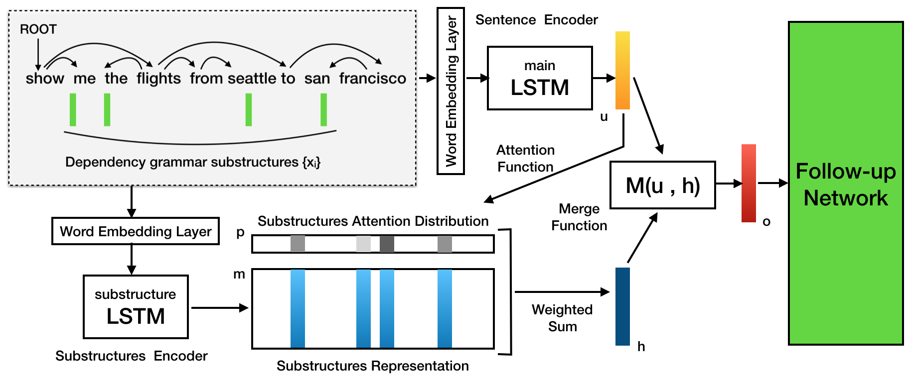

# 融合句法结构的文本理解
本科毕业设计

## 摘要
自然语言理解是自然语言处理乃至人工智能领域亟待研究重点与难点，
对其研究在理论上和实际应用上都有重要的意义.
随着深度学习的发展，基于循环神经网络(RNN)、长短期记忆网络(LSTM)等的序列建模方式已经成为了
自然语言处理的主流方法.
但是这些深度学习模型需要大规模训练数据，并且将复杂的语言分析和理解
过程简化成“黑盒子”，难以融合先验语言知识，进而使模型缺乏可解释性.

本文尝试将先验文本语言学知识引入传统深度学习模型中，提出了融合句法结构的深度神经网络.
该模型通过依存句法分析工具获得文本的句法子结构，
然后将文本的语义表示和结构表示分别通过两个独立的LSTM模型，
再将子结构输出的加权平均结果与主文本句子的输出结果相融合，
从而实现利用句法结构信息对句子表示增强，最后将这个增强表示送入后续的神经网络中以完成文本分类、机器翻译等文本理解的应用.

通过在文本理解的基础性任务文本分类上进行对照实验，
得出融合模型相对传统深度学习模型具有以下两个主要优点:
(1)由于引入了语言学知识，在小规模数据集上有明显优势；在大规模数据集上也有一定优势，模型有较好的鲁棒性.
(2)通过Attention机制可视化文本中不同结构的重要程度，使得模型具有一定的可解释性.

在实验中还对融合模型的Attention机制和融合方式开展了进一步的研究.最终在AGNews数据集上，
融合模型相对于LSTM模型在测试集上的正确率提升了2.5%.

## 模型

## 程序
基于Pytorch编程实现.

`python main.py`